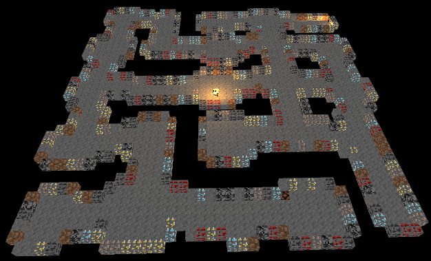
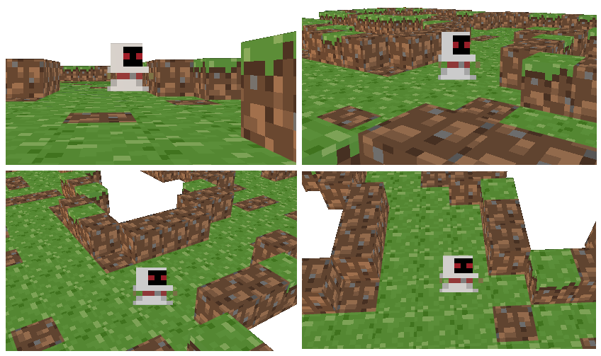

<link href="https://raw.github.com/jasonm23/markdown-css-themes/gh-pages/swiss.css" rel="stylesheet"></link>
<link href="style.css" rel="stylesheet"></link>

Description
===========

This project is a 2.5D dungeon exploration game. In this case, 2.5D refers to 
the fact that characters in the world are 2D objects (sprites) that exist in a 
3D environment. A technique called "billboarding" is used to keep sprites 
perpendicular to the line of sight of the camera, such that they are always 
facing the camera, creating the illusion that the 2D sprites are actually a part 
of the 3D world.

Setup
=====

The code can be found in the attached files, but they must be uploaded to a 
webserver before the game can be played, due to require.js's method of loading 
text files. A lightweight webserver for Windows that can be used is 
[mongoose][1] - using the program's default settings, open the program and 
navigate to localhost:8080 in a browser to play the game. Any other webserver 
such as Apache HTTP, Apache Tomcat, or nginx can also be used.

Gameplay
========

###Objective

_Figure 1. Entrance (left) and exit (right) of one floor of the dungeon_

The goal of the game is to explore a multi-level dungeon, guiding a follower to 
the exit of each floor. Characters and dungeon layouts are randomized on each
playthrough.

###Controls

* WASD keys for movement
* Right-click + drag to rotate the camera
* Scroll wheel to zoom in/out

Implementation
==============
The project is implemented in WebGL, using the following libraries: 

* [glMatrix][2]: convenient matrix and vector functions.
* [require.js][3]: allows code to be separated into different module files, 
  manages inter-module dependencies, and allows modules to be loaded on demand 
  when needed.

###Textures

Textures are stored in [texture atlas][4] image files -- images that contain 
many sub-images, each of which is a texture for some part of a 3D object. Since 
the application uses a lot of small textures for different objects (e.g., the 
terrain and characters), it is more efficient to use a large texture atlas than 
it is to bind several smaller textures when rendering. Sub-textures are chosen 
from the texture atlas by specifying texture coordinates of the object's uvmap 
based on the desired texture.

_Figure 2. Texture atlases used in the game_

In the case of this game, environment textures are loaded from a Minecraft 
[`terrain.png`][5]-styled texture atlas, and characters are from Oryx's [LOFI 
Fantasy spritesheets][6].

###Cube Generation

_Figure 3. Some examples of textured cubes_

The environment in the game is composed of textured cubes, where each face of a 
cube is loaded from the texture atlas. Cubes are specified by a 3D array, where 
the position in the array corresponds to the position of the cube. For example:

	cubes[5][0][3] = 4;
	cubes[5][0][4] = 0;

means that the cube located at `(3,0,5)` has textures corresponding to the 4th 
tile in the texture atlas, and the cube at `(4,0,5)` is an empty cube (`0` 
specifies that nothing is there). 

Each cube has six faces, but not all faces will be shown (e.g., if two cubes are 
right next to each other, the right face of the left cube and the left face of 
the right cube will never be seen).  When establishing the arrays to bind to the 
buffers (positions of vertices, texture coordinates, normals, etc), unnecessary 
faces of the cube are removed to reduce the amount of data that has to be sent 
to and processed by the GPU. 

###Level Generation

_Figure 4. An example of a randomly generated dungeon_

Each floor of the dungeon is randomly generated based on a simple [Roguelike 
dungeon generation algorithm][7]. The entire map is divided into a grid of 
rooms, with each room being a random size. Rooms are then randomly connected to 
neighboring rooms until eventually all rooms are connected. Connections 
(passageways) are made between the centers of each room using a version of 
[Bresenham's line algorithm][8] with thicker lines. The final result is sent to 
the cube generation stage and various cube types are chosen for walls and floors 
based on what level of the dungeon the player is in. 

###Characters

_Figure 5. A billboarded character. Note that the character's orientation 
remains the same regardless of the camera angle._

Characters are randomly chosen from a texture atlas of character sprites. To 
achieve a 2.5D effect, characters are individually billboarded -- they are 
always facing the camera. This is done in a separate vertex shader, so the 
environment is rendered first, the current glsl program is changed, and the 
characters are then rendered. A description of billboarding implementation can 
be found on NeHe's "[Billboarding How To][9]" page.

<!-- Footnotes -->
[1]: https://code.google.com/p/mongoose/downloads/list
[2]: http://glmatrix.net/
[3]: http://requirejs.org/
[4]: http://en.wikipedia.org/wiki/Texture_atlas
[5]: http://www.minecraftwiki.net/wiki/File:TerrainGuide.png
[6]: http://forums.tigsource.com/index.php?topic=8970.0
[7]: http://kuoi.com/~kamikaze/GameDesign/art07_rogue_dungeon.php
[8]: http://en.wikipedia.org/wiki/Bresenham's_line_algorithm
[9]: http://nehe.gamedev.net/article/billboarding_how_to/18011/

